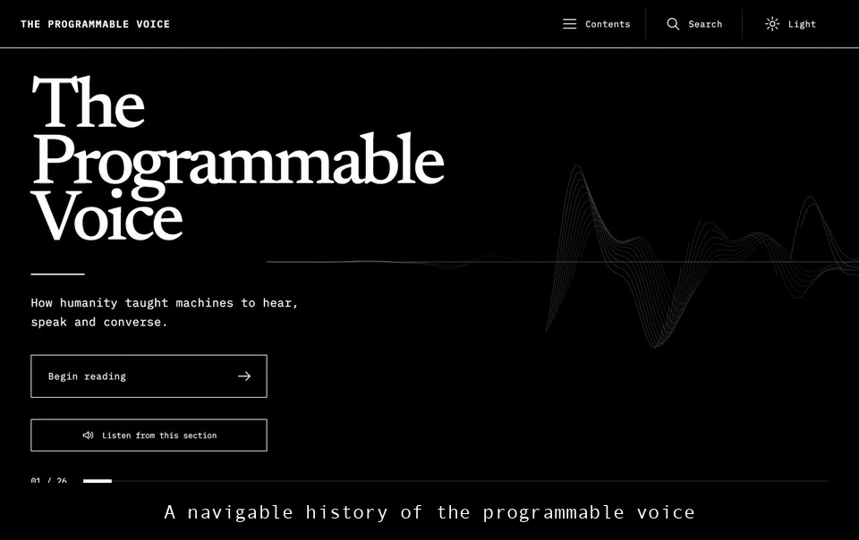

# The Programmable Voice

An interactive, evidence-led history of how humanity taught machines to hear, speak, and converse. Its optional OpenAI Realtime narrator reads the authored manuscript in a warm British style, checks the returned transcript before playback, follows each active passage, and keeps sources tucked away until requested.

[**Open the live book**](https://the-programmable-voice.vercel.app)

[](https://the-programmable-voice.vercel.app)

## What it does

- Presents 26 navigable sections spanning physical sound, recording, PCM and DSP, neural audio, conversational AI, and an 18-month builder programme.
- Offers optional OpenAI Realtime narration across 330 authored passages, with automatic chapter changes, scrolling, and passage highlighting.
- Keeps claim-level primary records, scholarship, standards, and vendor disclosures hidden until the reader opens the animated evidence drawer.
- Includes contents, search, light and dark themes, text-size controls, reduced motion, a no-JavaScript manuscript, and an offline Web Audio laboratory.

## How narration stays faithful

The browser requests a short-lived client secret from the server-side `POST /api/realtime-token` function, then establishes an output-only WebRTC session with `gpt-realtime-2.1`. The permanent `OPENAI_API_KEY` never enters the browser bundle.

Each selected manuscript passage is sent verbatim. Generated audio is held locally until the model's returned transcript normalizes to the same text; a mismatch stops playback. The session has no tools, does not request microphone access, and is instructed to use the `marin` voice in a warm, feminine British reading style without additions or paraphrases.

This is a transcript-consistency guard, not an independent acoustic transcription of the waveform or a guarantee of a particular speaker identity.

## Run locally

Requirements: Node.js `^20.19.0` or `>=22.12.0`.

```bash
npm install
cp .env.example .env.local
```

Add your server-side OpenAI key to `.env.local`, then run the complete Vercel application:

```bash
npx vercel dev
```

For UI-only work without Realtime narration:

```bash
npm run dev
```

## Verify

```bash
npm run check
npx playwright install chromium
npm run test:e2e
```

`npm run check` runs linting, unit tests, TypeScript, and the production build. The Playwright suite covers narration lifecycle, responsive reading across every section, accessibility, themes, evidence dialogs, and navigation.

## Deploy to Vercel

1. Import this repository into Vercel.
2. Add `OPENAI_API_KEY` as a server-only environment variable for Production and any Preview or Development environments that need narration.
3. Deploy. The included `vercel.json` configures the API function, SPA routing, security headers, and static manuscript fallback.

Never prefix the key with `VITE_`; that would expose it to client code. Selected manuscript passages are sent to OpenAI only when a reader explicitly starts narration.

## Licence

No project-wide licence has been selected yet. Public availability does not grant permission to reuse the code or manuscript. Bundled font licences are documented in [THIRD_PARTY_NOTICES.md](THIRD_PARTY_NOTICES.md).
